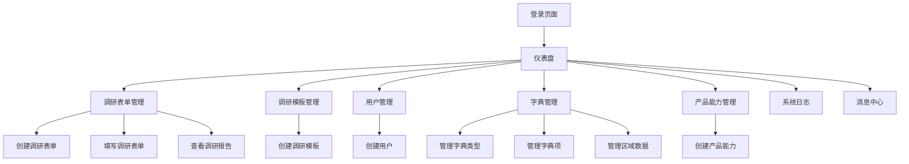

# EMS 售前调研工具产品需求文档

## 1. 产品概览
EMS 售前调研工具是一款专为售前工程师设计的智能化调研管理系统，用于收集、分析和管理客户的能源管理需求，生成专业的调研报告，辅助售前工程师快速响应客户需求，提高工作效率和专业性。

- **核心价值**：通过标准化的调研流程和智能化的报告生成，帮助售前工程师快速了解客户需求，提供精准的解决方案建议。
- **目标市场**：面向能源管理系统（EMS）供应商的售前团队，以及需要进行能源管理需求调研的相关企业。

## 2. 核心功能

### 2.1 用户角色
| 角色 | 注册方式 | 核心权限 |
|------|----------|----------|
| 超级管理员 | 系统预设 | 管理所有用户、角色、模板、调研表单、字典数据、查看系统日志 |
| 售前工程师 | 管理员创建 | 管理调研表单、查看调研报告、管理模板 |
| 客户用户 | 管理员创建 | 填写调研表单、查看自己的调研结果 |

### 2.2 功能模块
EMS 售前调研工具包含以下核心页面：
1. **仪表盘**：数据概览、统计分析、客户价值评估
2. **调研表单管理**：创建、编辑、查看、删除调研表单
3. **调研模板管理**：维护各行业的调研问卷模板
4. **用户管理**：管理系统用户账号
5. **字典管理**：维护系统基础数据字典
6. **产品能力管理**：管理公司产品和服务能力
7. **系统日志**：查看系统操作日志
8. **消息中心**：接收系统通知和报告生成消息

### 2.3 页面详情
| 页面名称 | 模块名称 | 功能描述 |
|---------|----------|----------|
| 仪表盘 | 数据概览 | 展示调研客户数量、调研项目数量、报告生成数量等关键指标 |
| 仪表盘 | 行业分布 | 通过饼图展示调研项目的行业分布情况 |
| 仪表盘 | 区域分布 | 通过饼图展示调研项目的区域分布情况 |
| 仪表盘 | 需求排行 | 通过柱状图展示客户需求的排行榜 |
| 仪表盘 | 客户价值图 | 通过散点图展示客户价值评估结果 |
| 调研表单管理 | 表单列表 | 展示所有调研表单，支持搜索、查看详情、删除、重填操作 |
| 调研表单管理 | 表单创建 | 创建新的调研表单，选择模板、填写基本信息 |
| 调研表单管理 | 表单填写 | 根据模板填写调研内容，支持实时保存 |
| 调研表单管理 | 报告预览 | 预览生成的调研报告，支持下载为Word或PDF格式 |
| 调研模板管理 | 模板列表 | 展示所有调研模板，支持查看详情 |
| 调研模板管理 | 模板创建 | 创建新的调研模板，设置行业、添加章节和字段 |
| 用户管理 | 用户列表 | 展示所有系统用户，支持搜索、编辑、删除、启用/禁用操作 |
| 用户管理 | 用户创建 | 创建新的系统用户，设置用户名、密码、角色、类型等 |
| 字典管理 | 字典类型管理 | 管理系统中的字典类型，如行业类型、区域类型等 |
| 字典管理 | 字典项管理 | 管理各字典类型下的具体数据项 |
| 字典管理 | 区域管理 | 管理中国行政区划数据 |
| 产品能力管理 | 产品列表 | 展示所有产品和服务能力，支持查看详情、编辑、删除操作 |
| 产品能力管理 | 产品创建 | 创建新的产品或服务能力，设置类型、适用行业、应用场景等 |
| 系统日志 | 日志列表 | 展示系统操作日志，支持按类型筛选 |
| 消息中心 | 消息列表 | 展示系统通知和报告生成消息，支持标记已读 |

## 3. Core Process
### 3.1 主要业务流程

**流程 1：售前工程师创建调研表单**
1. 售前工程师登录系统
2. 进入调研表单管理页面
3. 点击"创建调研表单"按钮
4. 填写表单基本信息（项目名称、客户名称、行业、区域等）
5. 选择合适的调研模板
6. 保存表单，进入填写页面

**流程 2：客户填写调研表单**
1. 客户用户登录系统
2. 进入调研表单管理页面
3. 找到分配给自己的调研表单
4. 点击"填写"按钮，进入填写页面
5. 根据模板填写调研内容
6. 提交表单，系统自动生成报告

**流程 3：生成调研报告**
1. 客户提交调研表单后，系统自动触发报告生成
2. 系统根据调研数据和预设规则生成调研报告
3. 售前工程师收到报告生成通知
4. 售前工程师查看和下载调研报告
5. 售前工程师根据报告内容与客户沟通解决方案

**流程 4：管理员管理系统**
1. 超级管理员登录系统
2. 管理用户账号和角色权限
3. 维护调研模板和字典数据
4. 查看系统操作日志
5. 监控系统运行状态

### 3.2 页面导航流程图

## 4. 用户接口设计
### 4.1 设计风格
- **主色和辅色**：
  - 主色：蓝色 (#3b82f6)，代表专业、信任和科技感
  - 辅色：绿色 (#10b981) 用于成功状态，红色 (#ef4444) 用于错误状态，黄色 (#f59e0b) 用于警告状态
- **按钮样式**：圆角矩形，主操作按钮使用实心填充，次要操作使用描边样式
- **字体**：系统默认无衬线字体，标题使用加粗样式，正文使用常规样式
- **布局样式**：基于卡片的模块化布局，清晰的视觉层次，响应式设计
- **图标样式**：使用简洁、现代的线性图标，保持视觉一致性

### 4.2 页面设计概览
| 页面名称 | 模块名称 | UI元素 |
|---------|----------|--------|
| 仪表盘 | 数据概览 | 卡片式布局，包含数字指标和图标，使用主色调强调重要数据 |
| 仪表盘 | 图表区域 | 使用柱状图、饼图、散点图等可视化组件，配色方案统一 |
| 调研表单管理 | 表单列表 | 表格布局，支持分页和搜索，操作按钮使用图标+文字组合 |
| 调研表单管理 | 表单填写 | 步骤式引导，表单字段分组展示，实时保存提示 |
| 调研模板管理 | 模板列表 | 卡片式布局，展示模板名称、行业和字段数量 |
| 用户管理 | 用户列表 | 表格布局，支持启用/禁用状态切换，操作按钮使用文字链接 |
| 字典管理 | 字典项管理 | 左侧树状导航，右侧表格展示，支持批量操作 |
| 系统日志 | 日志列表 | 表格布局，时间戳使用等宽字体，操作类型使用标签样式 |
| 消息中心 | 消息列表 | 卡片式布局，未读消息使用蓝色背景标识，支持批量标记已读 |

### 4.3 自适应
- **设计理念**：采用桌面优先设计，同时兼顾平板设备的适配
- **响应式断点**：
  - 桌面端：1200px以上
  - 平板端：768px-1199px
  - 移动端：767px以下
- **移动端适配**：
  - 简化导航菜单为汉堡菜单
  - 调整表格布局为卡片式布局
  - 优化表单填写体验，增大点击区域
  - 确保关键功能在移动端可用

## 5. 功能需求（Functional Requirements）

| 编号 | 功能点 | 用户故事/缘由说明 | 输入/输出/流程 | 详细说明 | 优先级 |
|------|--------|------------------|---------------|----------|--------|
| FR1 | 调研表单创建 | 作为售前工程师，我需要创建调研表单，以便开始收集客户需求 | 输入：项目名称、客户名称、行业、区域、模板选择 输出：创建成功的调研表单 流程：填写基本信息 → 选择模板 → 保存表单 | 支持从模板创建表单，自动填充基本结构，允许修改和自定义 | 高 |
| FR2 | 调研表单填写 | 作为客户用户，我需要填写调研表单，以便提供详细的需求信息 | 输入：调研问题答案 输出：填写完成的表单 流程：查看表单 → 填写内容 → 保存草稿 → 提交表单 | 支持实时保存，防止数据丢失，提供填写进度指示 | 高 |
| FR3 | 调研报告生成 | 作为售前工程师，我需要系统自动生成调研报告，以便快速了解客户需求并提供解决方案 | 输入：提交的调研表单 输出：结构化的调研报告 流程：系统分析数据 → 生成报告 → 通知用户 → 用户查看报告 | 报告应包含项目概况、调研结论、建议方案和预期效果等部分 | 高 |
| FR4 | 调研模板管理 | 作为管理员，我需要管理调研模板，以便适应不同行业和场景的需求 | 输入：模板名称、行业、章节和字段 输出：创建或更新的模板 流程：创建模板 → 添加章节 → 配置字段 → 保存模板 | 支持按行业分类模板，允许复制和修改现有模板 | 中 |
| FR5 | 用户管理 | 作为管理员，我需要管理系统用户，以便控制访问权限和确保系统安全 | 输入：用户信息、角色分配 输出：创建或更新的用户账号 流程：填写用户信息 → 分配角色 → 设置状态 → 保存用户 | 支持内部和外部用户类型，提供启用/禁用用户功能 | 高 |
| FR6 | 字典管理 | 作为管理员，我需要管理系统字典数据，以便统一和标准化系统中的枚举值 | 输入：字典类型和字典项 输出：创建或更新的字典数据 流程：创建字典类型 → 添加字典项 → 设置状态 → 保存数据 | 支持行业类型、区域类型等多种字典类型的管理 | 中 |
| FR7 | 产品能力管理 | 作为管理员，我需要管理产品能力数据，以便系统能够根据客户需求推荐合适的解决方案 | 输入：产品名称、类型、适用行业、应用场景 输出：创建或更新的产品能力 流程：填写产品信息 → 设置适用范围 → 保存产品 | 支持软件、硬件和咨询服务三种产品类型 | 中 |
| FR8 | 系统日志管理 | 作为管理员，我需要查看系统操作日志，以便审计和排查问题 | 输入：日志类型筛选 输出：筛选后的日志列表 流程：进入日志页面 → 选择日志类型 → 查看日志详情 | 记录用户登录、操作、错误等系统事件，支持按类型筛选 | 中 |
| FR9 | 消息通知 | 作为系统用户，我需要接收系统通知，以便及时了解重要事件 | 输入：系统事件 输出：消息通知 流程：系统触发事件 → 生成通知 → 用户接收通知 → 用户查看详情 | 支持系统通知和报告生成通知，提供未读标记 | 中 |
| FR10 | 数据统计分析 | 作为售前工程师，我需要查看数据统计分析，以便了解市场趋势和客户需求分布 | 输入：时间范围选择 输出：统计图表和分析结果 流程：进入仪表盘 → 选择时间范围 → 查看统计数据 | 提供客户数量、项目数量、报告数量等关键指标，以及行业和区域分布图表 | 中 |

## 6. 非功能需求（Non-Functional Requirements）

| 编号 | 需求点 | 详细说明 | 优先级 |
|------|--------|----------|--------|
| NFR1 | 性能要求 | 系统应具备良好的响应速度，页面加载时间不超过2秒，表单提交响应时间不超过3秒，报告生成时间不超过10秒 | 高 |
| NFR2 | 安全性 | 系统应采用Supabase的Row Level Security机制，确保用户只能访问授权范围内的数据，密码应进行加密存储，防止SQL注入和XSS攻击 | 高 |
| NFR3 | 可靠性 | 系统应具备良好的容错能力，在网络中断等异常情况下能够恢复数据，确保数据不丢失 | 高 |
| NFR4 | 可扩展性 | 系统架构应具备良好的可扩展性，能够方便地添加新功能和集成第三方服务 | 中 |
| NFR5 | 可维护性 | 代码应采用模块化设计，具备良好的注释和文档，便于后续维护和升级 | 中 |
| NFR6 | 兼容性 | 系统应兼容主流浏览器，包括Chrome、Firefox、Safari和Edge的最新版本 | 中 |
| NFR7 | 可用性 | 系统应具备99.9%的可用性，计划内维护时间应安排在非工作时间 | 中 |

## 7. 数据需求

| 编号 | 数据点 | 数据结构 | 存储方式 | 优先级 |
|------|--------|----------|----------|--------|
| DR1 | 用户数据 | 包含用户ID、姓名、用户名、密码哈希、类型、角色ID、客户信息、状态、创建时间 | Supabase数据库users表 | 高 |
| DR2 | 角色数据 | 包含角色ID、名称、描述、权限、状态、创建时间 | Supabase数据库roles表 | 高 |
| DR3 | 调研表单数据 | 包含表单ID、名称、客户名称、项目名称、行业、区域、模板ID、状态、报告状态、创建者ID、提交者ID、负责人ID、数据内容、创建时间 | Supabase数据库survey_forms表 | 高 |
| DR4 | 调研模板数据 | 包含模板ID、名称、行业、章节和字段配置、创建时间 | Supabase数据库survey_templates表 | 高 |
| DR5 | 调研报告数据 | 包含报告ID、表单ID、报告内容、生成时间 | Supabase数据库survey_reports表 | 高 |
| DR6 | 字典类型数据 | 包含类型ID、类型名称、类型代码、描述、状态、排序、创建时间、创建者ID | Supabase数据库dict_types表 | 中 |
| DR7 | 字典项数据 | 包含项ID、类型ID、标签、值、排序、状态、扩展字段、创建时间、创建者ID | Supabase数据库dict_items表 | 中 |
| DR8 | 区域字典数据 | 包含区域ID、区域名称、区域代码、父级ID、层级、排序、状态、是否系统预设、创建时间 | Supabase数据库region_dicts表 | 中 |
| DR9 | 产品能力数据 | 包含产品ID、名称、类型、适用行业、应用场景、描述、创建时间 | Supabase数据库product_capabilities表 | 中 |
| DR10 | 系统日志数据 | 包含日志ID、操作者ID、类型、内容、IP地址、结果、创建时间 | Supabase数据库system_logs表 | 中 |
| DR11 | 消息数据 | 包含消息ID、标题、内容、类型、是否已读、是否已清除、目标角色ID、目标用户ID、项目ID、创建时间 | Supabase数据库messages表 | 中 |

## 8. 范围限定

| 编号 | 边界/范围限定 | 说明 | 范围限定类型 |
|------|---------------|------|--------------|
| SL1 | 仅支持能源管理行业 | 系统专注于能源管理系统（EMS）的售前调研，不支持其他行业的调研需求 | 业务范围 |
| SL2 | 基于浏览器的Web应用 | 系统为纯Web应用，不提供移动端原生应用，仅通过浏览器访问 | 技术范围 |
| SL3 | 依赖Supabase数据库 | 系统使用Supabase作为后端数据库和认证服务，不支持其他数据库系统 | 技术范围 |
| SL4 | 有限的AI能力 | 系统具备基础的AI辅助功能，如报告生成，但不包含复杂的自然语言处理和深度学习能力 | 功能范围 |
| SL5 | 内部使用系统 | 系统为企业内部使用的工具，不面向外部用户开放注册和使用 | 业务范围 |

## 9. 验收标准

| 编号 | 关联需求 | 验收说明 | 测试方法 |
|------|----------|----------|----------|
| AC1 | FR1, FR2, FR3 | 能够成功创建调研表单，填写并提交，系统自动生成调研报告 | 功能测试：完整流程测试 |
| AC2 | FR4 | 能够创建、编辑和管理调研模板，模板能够正确应用到调研表单 | 功能测试：模板管理操作测试 |
| AC3 | FR5 | 能够创建、编辑、启用/禁用用户，不同角色用户具有相应的权限 | 功能测试：用户管理和权限测试 |
| AC4 | FR6 | 能够管理字典类型和字典项，字典数据能够在系统中正确显示和使用 | 功能测试：字典管理操作测试 |
| AC5 | FR7 | 能够管理产品能力数据，系统能够根据产品能力推荐解决方案 | 功能测试：产品能力管理测试 |
| AC6 | FR8 | 系统能够记录和展示系统操作日志，支持按类型筛选 | 功能测试：日志管理测试 |
| AC7 | FR9 | 系统能够发送和接收消息通知，支持标记已读 | 功能测试：消息通知测试 |
| AC8 | FR10 | 仪表盘能够展示准确的统计数据和图表，支持不同时间范围的数据查看 | 功能测试：仪表盘数据测试 |
| AC9 | NFR1 | 系统响应速度符合性能要求，页面加载和操作响应时间在规定范围内 | 性能测试：响应时间测试 |
| AC10 | NFR2 | 系统能够正确实施权限控制，用户只能访问授权范围内的数据 | 安全测试：权限控制测试 |
| AC11 | NFR3, NFR4 | 系统能够在网络中断等异常情况下恢复数据，具备良好的容错能力 | 可靠性测试：异常场景测试 |
| AC12 | NFR6 | 系统在主流浏览器中能够正常运行，界面显示正确 | 兼容性测试：多浏览器测试 |

## 10. 风险/依赖备注

| 类型     | 关联编号/功能点 | 具体内容/说明                          | 备注      |
| :----- | :------- | :------------------------------- | :------ |
| 风险点    | FR3/调研报告生成 | 报告生成的质量和准确性依赖于调研数据的完整性和质量 | 建议在系统中添加数据完整性检查，确保生成的报告质量 |
| 风险点    | NFR1/性能要求 | 随着数据量的增长，报告生成和统计分析可能会变慢 | 建议实现数据分页和缓存机制，优化数据库查询性能 |
| 风险点    | NFR2/安全性 | Supabase的Row Level Security配置复杂，可能存在权限漏洞 | 建议仔细设计和测试RLS策略，确保数据安全 |
| 依赖项    | FR3/调研报告生成 | 依赖Gemini API或其他AI服务进行报告内容生成 | 确保API密钥配置正确，监控API使用情况 |
| 依赖项    | 全部功能 | 依赖Supabase服务的稳定性和可用性 | 建议配置Supabase的监控和告警机制，定期备份数据 |
| 依赖项    | FR10/数据统计分析 | 依赖Recharts等图表库进行数据可视化 | 确保图表库版本兼容，优化图表渲染性能 |
| 风险点    | SL4/有限的AI能力 | AI生成的报告可能缺乏行业深度和针对性 | 建议提供报告编辑功能，允许售前工程师手动调整和完善报告内容 |
| 风险点    | FR2/调研表单填写 | 复杂的调研表单可能导致客户填写体验不佳，影响数据质量 | 建议优化表单设计，提供清晰的填写指引和示例 |
