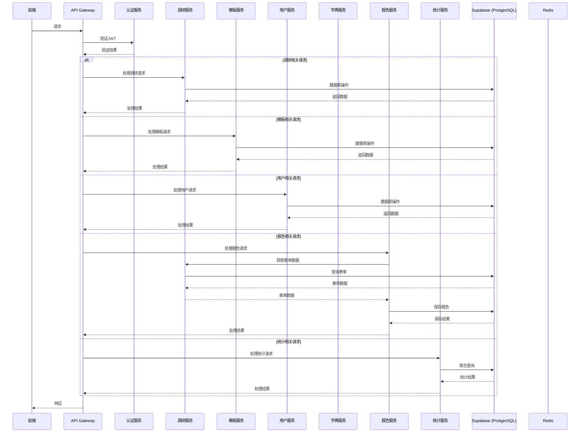
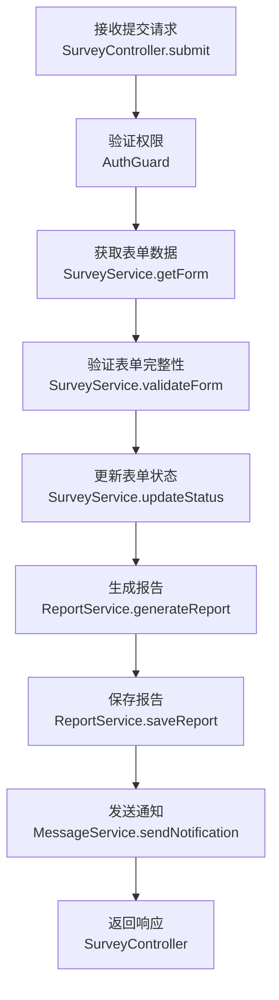
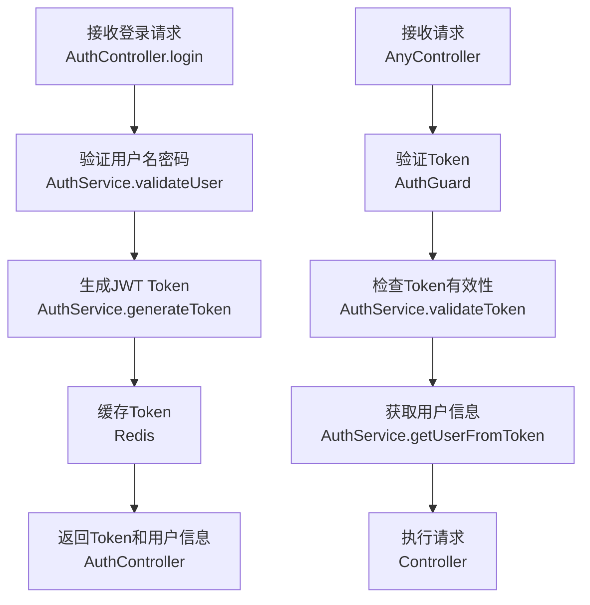

# EMS 售前调研工具 - 后端技术方案

## 1. 技术选型

| 分类 | 技术 | 版本 | 选型理由 |
|------|------|------|----------|
| 语言 | TypeScript | 5.0+ | 类型安全，与前端技术栈一致 |
| 框架 | NestJS | 10.0+ | 模块化架构，依赖注入，完整的生态系统 |
| 数据库 | PostgreSQL (Supabase) | 15.0+ | 强大的关系型数据库，支持JSONB类型，适合存储复杂表单数据 |
| 缓存 | Redis | 7.0+ | 用于缓存热点数据和管理Session/Token |
| 认证 | JWT | - | 无状态认证，便于水平扩展 |
| ORM | Prisma | 5.0+ | 类型安全的数据库访问，自动生成类型定义 |
| 日志 | Winston | 3.0+ | 灵活的日志管理 |
| 测试 | Jest + Supertest | - | 单元测试和API测试 |
| 部署 | Docker | - | 容器化部署，环境一致性 |

## 2. 系统架构

### 2.1 架构图



### 2.2 核心流程图

#### 2.2.1 调研表单提交流程



#### 2.2.2 用户认证流程



## 3. 目录结构

```plaintext
backend/
├── src/
│   ├── app.module.ts                 # 根模块
│   ├── main.ts                       # 入口文件
│   ├── auth/                         # 认证模块
│   │   ├── auth.module.ts
│   │   ├── auth.controller.ts
│   │   ├── auth.service.ts
│   │   ├── guards/
│   │   │   └── jwt.guard.ts
│   │   └── strategies/
│   │       └── jwt.strategy.ts
│   ├── users/                        # 用户模块
│   │   ├── users.module.ts
│   │   ├── users.controller.ts
│   │   ├── users.service.ts
│   │   └── dto/
│   │       ├── create-user.dto.ts
│   │       └── update-user.dto.ts
│   ├── roles/                        # 角色模块
│   │   ├── roles.module.ts
│   │   ├── roles.controller.ts
│   │   ├── roles.service.ts
│   │   └── dto/
│   │       ├── create-role.dto.ts
│   │       └── update-role.dto.ts
│   ├── surveys/                      # 调研模块
│   │   ├── surveys.module.ts
│   │   ├── surveys.controller.ts
│   │   ├── surveys.service.ts
│   │   └── dto/
│   │       ├── create-survey.dto.ts
│   │       └── update-survey.dto.ts
│   ├── templates/                    # 模板模块
│   │   ├── templates.module.ts
│   │   ├── templates.controller.ts
│   │   ├── templates.service.ts
│   │   └── dto/
│   │       ├── create-template.dto.ts
│   │       └── update-template.dto.ts
│   ├── reports/                      # 报告模块
│   │   ├── reports.module.ts
│   │   ├── reports.controller.ts
│   │   ├── reports.service.ts
│   │   └── dto/
│   │       └── generate-report.dto.ts
│   ├── dictionaries/                 # 字典模块
│   │   ├── dictionaries.module.ts
│   │   ├── dictionaries.controller.ts
│   │   ├── dictionaries.service.ts
│   │   └── dto/
│   │       ├── create-dict-type.dto.ts
│   │       └── create-dict-item.dto.ts
│   ├── messages/                     # 消息模块
│   │   ├── messages.module.ts
│   │   ├── messages.controller.ts
│   │   └── messages.service.ts
│   ├── logs/                         # 日志模块
│   │   ├── logs.module.ts
│   │   ├── logs.controller.ts
│   │   └── logs.service.ts
│   ├── stats/                        # 统计模块
│   │   ├── stats.module.ts
│   │   ├── stats.controller.ts
│   │   └── stats.service.ts
│   ├── common/                       # 公共模块
│   │   ├── filters/
│   │   │   └── http-exception.filter.ts
│   │   ├── interceptors/
│   │   │   ├── logging.interceptor.ts
│   │   │   └── response.interceptor.ts
│   │   ├── decorators/
│   │   │   └── roles.decorator.ts
│   │   └── utils/
│   │       ├── password.util.ts
│   │       └── jwt.util.ts
│   ├── config/
│   │   └── config.service.ts
│   └── prisma/
│       ├── prisma.service.ts
│       └── schema.prisma
├── .env.example
├── package.json
├── tsconfig.json
├── nest-cli.json
└── Dockerfile
```

## 4. 核心模块实现

### 4.1 认证模块

#### 4.1.1 AuthService

```typescript
@Injectable()
export class AuthService {
  constructor(
    private usersService: UsersService,
    private jwtService: JwtService,
    private redisService: RedisService
  ) {}

  async validateUser(username: string, password: string): Promise<any> {
    const user = await this.usersService.findByUsername(username);
    if (user && await this.verifyPassword(password, user.password_hash)) {
      const { password_hash, ...result } = user;
      return result;
    }
    return null;
  }

  async login(user: any) {
    const payload = { username: user.username, sub: user.id, role: user.role };
    const token = this.jwtService.sign(payload);
    
    // 缓存token
    await this.redisService.set(`token:${user.id}`, token, {
      ttl: 86400 // 24小时
    });
    
    return {
      access_token: token,
      user
    };
  }

  async logout(userId: string) {
    await this.redisService.del(`token:${userId}`);
    return { message: '登出成功' };
  }

  async refreshToken(userId: string) {
    const user = await this.usersService.findById(userId);
    const payload = { username: user.username, sub: user.id, role: user.role };
    const token = this.jwtService.sign(payload);
    
    await this.redisService.set(`token:${userId}`, token, {
      ttl: 86400
    });
    
    return { access_token: token };
  }

  private async verifyPassword(password: string, hash: string): Promise<boolean> {
    return bcrypt.compare(password, hash);
  }
}
```

### 4.2 调研模块

#### 4.2.1 SurveyService

```typescript
@Injectable()
export class SurveyService {
  constructor(
    private prisma: PrismaService,
    private reportService: ReportService,
    private messageService: MessageService
  ) {}

  async create(data: CreateSurveyDto, userId: string): Promise<Survey> {
    const survey = await this.prisma.surveyForm.create({
      data: {
        ...data,
        creator_id: userId,
        status: '草稿',
        report_status: '未生成',
        data: {}
      }
    });
    return survey;
  }

  async update(id: string, data: UpdateSurveyDto): Promise<Survey> {
    return this.prisma.surveyForm.update({
      where: { id },
      data: {
        ...data,
        update_time: new Date()
      }
    });
  }

  async submit(id: string, userId: string): Promise<Survey> {
    // 开始事务
    const survey = await this.prisma.$transaction(async (prisma) => {
      // 更新表单状态
      const updatedSurvey = await prisma.surveyForm.update({
        where: { id },
        data: {
          status: '已完成',
          report_status: '已生成',
          submitter_id: userId,
          update_time: new Date()
        }
      });

      // 生成报告
      await this.reportService.generateReport(id, userId);

      // 发送通知
      await this.messageService.sendNotification({
        title: '报告生成成功',
        content: `您的调研表单"${updatedSurvey.name}"已提交成功，报告已生成`,
        type: 'report',
        target_user_id: updatedSurvey.pre_sales_responsible_id || userId
      });

      return updatedSurvey;
    });

    return survey;
  }

  async refill(id: string): Promise<Survey> {
    return this.prisma.surveyForm.update({
      where: { id },
      data: {
        status: '草稿',
        report_status: '未生成',
        update_time: new Date()
      }
    });
  }

  async validateForm(data: any): Promise<boolean> {
    // 验证表单数据完整性
    // 实现具体的验证逻辑
    return true;
  }
}
```

### 4.3 报告模块

#### 4.3.1 ReportService

```typescript
@Injectable()
export class ReportService {
  constructor(
    private prisma: PrismaService,
    private geminiService: GeminiService
  ) {}

  async generateReport(formId: string, userId: string): Promise<Report> {
    // 获取表单数据
    const form = await this.prisma.surveyForm.findUnique({
      where: { id: formId }
    });

    if (!form) {
      throw new NotFoundException('表单不存在');
    }

    // 使用AI生成报告内容
    const reportContent = await this.geminiService.generateEnergyReport(form);

    // 保存报告
    const report = await this.prisma.surveyReport.create({
      data: {
        form_id: formId,
        content: reportContent
      }
    });

    return report;
  }

  async getReportByFormId(formId: string): Promise<Report> {
    return this.prisma.surveyReport.findUnique({
      where: { form_id: formId }
    });
  }

  async downloadReport(formId: string, format: 'word' | 'pdf'): Promise<Buffer> {
    const report = await this.getReportByFormId(formId);
    
    // 根据格式生成对应文件
    if (format === 'word') {
      return this.generateWordReport(report.content);
    } else {
      return this.generatePdfReport(report.content);
    }
  }

  private async generateWordReport(content: string): Promise<Buffer> {
    // 实现Word文档生成
    return Buffer.from(content);
  }

  private async generatePdfReport(content: string): Promise<Buffer> {
    // 实现PDF文档生成
    return Buffer.from(content);
  }
}
```

### 4.4 统计模块

#### 4.4.1 StatsService

```typescript
@Injectable()
export class StatsService {
  constructor(private prisma: PrismaService) {}

  async getDashboardStats(): Promise<DashboardStats> {
    // 获取客户数量
    const customerCount = await this.prisma.surveyForm.count({
      distinct: ['customer_name']
    });

    // 获取项目数量
    const projectCount = await this.prisma.surveyForm.count({
      distinct: ['project_name']
    });

    // 获取表单总数
    const formCount = await this.prisma.surveyForm.count();

    // 获取已完成表单数量
    const completedCount = await this.prisma.surveyForm.count({
      where: { status: '已完成' }
    });

    // 计算完成率
    const completionRate = formCount > 0 ? (completedCount / formCount) * 100 : 0;

    // 获取报告数量
    const reportCount = await this.prisma.surveyReport.count();

    // 计算报告查看率（模拟）
    const reportViewRate = reportCount > 0 ? 90.0 : 0;

    return {
      customer_count: customerCount,
      project_count: projectCount,
      form_count: formCount,
      completion_rate: parseFloat(completionRate.toFixed(1)),
      report_count: reportCount,
      report_view_rate: reportViewRate
    };
  }

  async getIndustryStats(): Promise<IndustryStats[]> {
    const stats = await this.prisma.surveyForm.groupBy({
      by: ['industry'],
      _count: { industry: true }
    });

    return stats.map(item => ({
      industry: item.industry,
      count: item._count.industry
    }));
  }

  async getStatusStats(): Promise<StatusStats> {
    const stats = await this.prisma.surveyForm.groupBy({
      by: ['status'],
      _count: { status: true }
    });

    const result: StatusStats = {
      draft: 0,
      filling: 0,
      completed: 0
    };

    stats.forEach(item => {
      if (item.status === '草稿') result.draft = item._count.status;
      if (item.status === '填写中') result.filling = item._count.status;
      if (item.status === '已完成') result.completed = item._count.status;
    });

    return result;
  }
}
```

## 5. 数据库设计

### 5.1 数据库表结构

**详细数据库设计请参考 `database-design.md` 文件**

主要表结构包括：
- `users` - 用户表
- `roles` - 角色表
- `survey_forms` - 调研表单表
- `survey_reports` - 调研报告表
- `survey_templates` - 调研模板表
- `dict_types` - 字典类型表
- `dict_items` - 字典项表
- `region_dicts` - 区域字典表
- `product_capabilities` - 产品能力表
- `system_logs` - 系统日志表
- `messages` - 消息表

### 5.2 索引设计

**详细索引设计请参考 `database-design.md` 文件**

主要索引包括：
- 用户表索引：用户名、类型、状态
- 调研表单索引：状态、创建人、客户名称、项目名称
- 字典表索引：类型ID、父区域ID
- 日志表索引：操作人、类型、创建时间
- 消息表索引：目标用户、目标角色、已读状态

### 5.3 外键关系

**详细外键关系请参考 `database-design.md` 文件**

主要外键关系包括：
- `users.role_id` → `roles.id`
- `survey_forms.template_id` → `survey_templates.id`
- `survey_forms.creator_id` → `users.id`
- `survey_forms.submitter_id` → `users.id`
- `survey_forms.pre_sales_responsible_id` → `users.id`
- `survey_reports.form_id` → `survey_forms.id`
- `dict_items.type_id` → `dict_types.type_id`

## 6. API 接口设计

### 6.1 认证接口

**详细认证接口设计请参考 `api-design.md` 文件**

- `POST /api/auth/login` - 登录
- `POST /api/auth/logout` - 登出
- `POST /api/auth/refresh` - 刷新令牌

### 6.2 用户管理接口

**详细用户管理接口设计请参考 `api-design.md` 文件**

- `GET /api/users` - 获取用户列表
- `POST /api/users` - 创建用户
- `PUT /api/users/{id}` - 更新用户
- `DELETE /api/users/{id}` - 删除用户
- `PATCH /api/users/{id}/status` - 切换用户状态

### 6.3 角色管理接口

**详细角色管理接口设计请参考 `api-design.md` 文件**

- `GET /api/roles` - 获取角色列表
- `POST /api/roles` - 创建角色
- `PUT /api/roles/{id}` - 更新角色
- `DELETE /api/roles/{id}` - 删除角色

### 6.4 调研表单接口

**详细调研表单接口设计请参考 `api-design.md` 文件**

- `GET /api/surveys` - 获取表单列表
- `POST /api/surveys` - 创建表单
- `GET /api/surveys/{id}` - 获取表单详情
- `PUT /api/surveys/{id}` - 更新表单数据
- `POST /api/surveys/{id}/submit` - 提交表单
- `POST /api/surveys/{id}/refill` - 重填表单
- `DELETE /api/surveys/{id}` - 删除表单

### 6.5 模板管理接口

**详细模板管理接口设计请参考 `api-design.md` 文件**

- `GET /api/templates` - 获取模板列表
- `POST /api/templates` - 创建模板
- `PUT /api/templates/{id}` - 更新模板
- `DELETE /api/templates/{id}` - 删除模板

### 6.6 字典管理接口

**详细字典管理接口设计请参考 `api-design.md` 文件**

- `GET /api/dictionaries/types` - 获取字典类型列表
- `GET /api/dictionaries/items` - 获取字典项列表
- `POST /api/dictionaries/types` - 创建字典类型
- `POST /api/dictionaries/items` - 创建字典项

### 6.7 报告接口

**详细报告接口设计请参考 `api-design.md` 文件**

- `GET /api/reports/{form_id}` - 获取报告
- `POST /api/reports/generate/{form_id}` - 生成报告
- `GET /api/reports/{form_id}/download` - 下载报告

### 6.8 系统接口

**详细系统接口设计请参考 `api-design.md` 文件**

- `GET /api/logs` - 获取系统日志
- `GET /api/messages` - 获取消息列表
- `PATCH /api/messages/{id}/read` - 标记消息已读
- `PATCH /api/messages/{id}/clear` - 清除消息

### 6.9 统计接口

**详细统计接口设计请参考 `api-design.md` 文件**

- `GET /api/stats/dashboard` - 获取仪表板统计数据
- `GET /api/stats/industry` - 获取行业分布统计
- `GET /api/stats/status` - 获取表单状态统计

## 7. 部署方案

### 7.1 本地开发

1. **环境准备**
   - Node.js 18.0+
   - PostgreSQL 15.0+ (或使用 Supabase 本地开发环境)
   - Redis 7.0+

2. **安装依赖**
   ```bash
   npm install
   ```

3. **配置环境变量**
   - 复制 `.env.example` 为 `.env`
   - 填写数据库连接信息和其他配置

4. **数据库迁移**
   ```bash
   npx prisma migrate dev
   ```

5. **启动开发服务器**
   ```bash
   npm run start:dev
   ```

### 7.2 Docker 部署

1. **Dockerfile**
   ```dockerfile
   FROM node:18-alpine

   WORKDIR /app

   COPY package*.json ./
   RUN npm install

   COPY . .

   RUN npm run build

   EXPOSE 3000

   CMD ["npm", "run", "start:prod"]
   ```

2. **Docker Compose**
   ```yaml
   version: '3.8'

   services:
     backend:
       build: .
       ports:
         - "3000:3000"
       environment:
         - DATABASE_URL=postgresql://user:password@db:5432/ems
         - REDIS_URL=redis://redis:6379
         - JWT_SECRET=your-secret-key
       depends_on:
         - db
         - redis

     db:
       image: postgres:15-alpine
       environment:
         - POSTGRES_USER=user
         - POSTGRES_PASSWORD=password
         - POSTGRES_DB=ems
       volumes:
         - postgres_data:/var/lib/postgresql/data

     redis:
       image: redis:7-alpine
       volumes:
         - redis_data:/data

   volumes:
     postgres_data:
     redis_data:
   ```

3. **部署命令**
   ```bash
   docker-compose up -d
   ```

### 7.3 Supabase 部署

1. **创建 Supabase 项目**
   - 登录 Supabase 控制台
   - 创建新项目
   - 获取数据库连接字符串

2. **配置环境变量**
   - 设置 `DATABASE_URL` 为 Supabase 连接字符串
   - 设置其他必要的环境变量

3. **部署到云平台**
   - Vercel
   - Netlify
   - AWS Lambda
   - Google Cloud Run

## 8. 安全考虑

### 8.1 认证与授权

- **JWT 认证**：使用 JSON Web Token 进行无状态认证
- **密码加密**：使用 bcrypt 对密码进行哈希处理
- **权限控制**：基于角色的访问控制 (RBAC)
- **API 保护**：使用 Guards 保护敏感接口

### 8.2 数据安全

- **输入验证**：对所有用户输入进行严格验证
- **SQL 注入防护**：使用 Prisma ORM 防止 SQL 注入
- **XSS 防护**：对输出进行适当转义
- **CSRF 防护**：实现 CSRF 令牌验证

### 8.3 网络安全

- **HTTPS**：强制使用 HTTPS 协议
- **CORS**：配置适当的 CORS 策略
- **速率限制**：对敏感接口实施速率限制
- **日志审计**：记录所有关键操作日志

### 8.4 依赖安全

- **依赖检查**：定期检查依赖包的安全漏洞
- **版本锁定**：使用 package-lock.json 锁定依赖版本
- **最小权限**：容器运行时使用最小权限原则

## 9. 监控与维护

### 9.1 日志系统

- **应用日志**：使用 Winston 记录应用日志
- **数据库日志**：启用 PostgreSQL 慢查询日志
- **访问日志**：记录 API 访问日志

### 9.2 监控指标

- **健康检查**：实现 `/health` 接口
- **性能监控**：监控 API 响应时间
- **错误监控**：监控错误率和类型
- **资源监控**：监控 CPU、内存、磁盘使用

### 9.3 备份策略

- **数据库备份**：配置定期数据库备份
- **代码备份**：使用 Git 进行版本控制
- **配置备份**：备份重要配置文件

## 10. 开发规范

### 10.1 代码规范

- **ESLint**：使用 ESLint 检查代码质量
- **Prettier**：使用 Prettier 格式化代码
- **TypeScript**：严格使用 TypeScript 类型
- **命名规范**：使用驼峰命名法

### 10.2 提交规范

- **Commit Message**：使用 Conventional Commits 规范
- **分支管理**：使用 Git Flow 工作流
- **代码审查**：实施代码审查流程

### 10.3 测试规范

- **单元测试**：对核心功能进行单元测试
- **集成测试**：测试模块间的集成
- **E2E 测试**：测试完整的业务流程
- **测试覆盖率**：保持测试覆盖率在 80% 以上

## 11. 总结

本技术方案基于 NestJS 和 Supabase 构建了一个完整的 EMS 售前调研工具后端系统。系统采用模块化架构，提供了丰富的 API 接口，支持用户管理、调研表单管理、报告生成、数据统计等核心功能。

主要特点：

1. **技术先进性**：使用 TypeScript、NestJS、Prisma 等现代技术
2. **架构合理性**：模块化设计，职责清晰，易于扩展
3. **数据安全**：完善的认证授权机制，数据加密存储
4. **性能优化**：合理的数据库设计，缓存策略
5. **可维护性**：规范的代码结构，完善的文档

该方案为 EMS 售前调研工具提供了坚实的后端基础，能够支持前端应用的所有功能需求，并为未来的功能扩展预留了空间。
